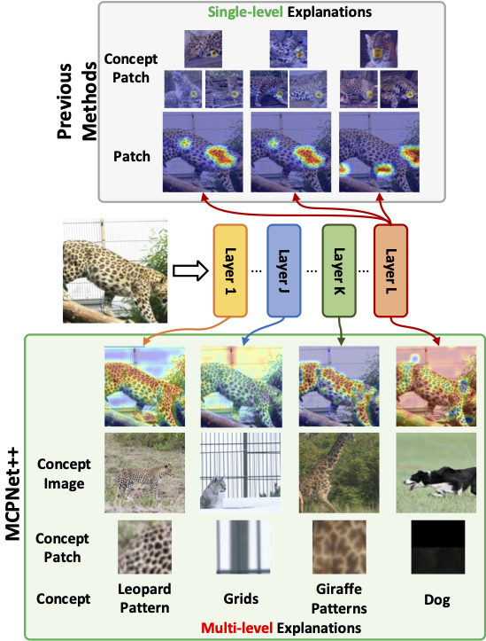

# MCPNet++: An Interpretable Classifier via Multi-Level Concept Prototypes [TPAMI 2026]
[Bor-Shiun Wang](https://eddie221.github.io/),
[Chien-Yi Wang](https://chienyiwang.github.io/)\*,
[Wei-Chen Chiu](https://walonchiu.github.io/)\*

<sup>*Equal Advising</sup>

Official PyTorch implementation of TPAMI 2026 paper "[MCPNet++: An Interpretable Classifier via Multi-Level Concept Prototypes](#introduction)".

[[`Paper`](#introduction)] [[`Website`](#introduction)] [[`BibTeX`](#citation)]

## Introduction
Post-hoc and inherently interpretable methods have shown great success in uncovering the inner workings of black-box models, whether by examining them after training or by explicitly designing for interpretability. While these approaches effectively narrow the semantic gap between a model’s latent space and human understanding, they typically extract only high-level semantics from the model’s final feature map. As a result, they provide a limited perspective on the decision-making process. We argue that explanations lacking insight into both lower- and mid-level semantics cannot be considered fully faithful or genuinely useful. To address this issue, we introduce the Multi-Level Concept Prototypes Classifier (MCPNet), which offers a more holistic interpretation by drawing on information from multiple levels within the model. Rather than relying on predefined concept labels, MCPNet autonomously discovers meaningful concepts from feature maps. To increase versatility, we further propose MCPNet++, which can be seamlessly applied to both CNN and transformer backbones, allowing it to learn meaningful concepts from their respective features. Building on these learned concepts, we also introduce a large language model (LLM)-based method to bridge the gap between these concepts and human perception. Experimental results show that MCPNet++ provides more comprehensive explanations without sacrificing model performance, with the discovered concepts aligning closely with human understanding.

<div align="center">
  
</div>

## Usage
### Enviroment  

```bash
conda env create --file MCPNet_pp.yml --name mcpnet_pp
```

### Dataset
The code can be applied to any imaging classification dataset, structured according to the [Imagefolder format](https://pytorch.org/vision/stable/generated/torchvision.datasets.ImageFolder.html#torchvision.datasets.ImageFolder): 

>root/class1/xxx.png  <br /> root/class1/xxy.png  <br /> root/class2/xyy.png <br /> root/class2/yyy.png

Add or update the paths to your dataset in ``train_utils/arg_reader.py``. 


### Training
```bash
python -m torch.distributed.launch --nproc_per_node=4 --master_port 9568 train.py \
    --case_name AWA2_vit \
    --basic_model vit_b_16 \
    --device 0 1 2 3 \
    --dataset_name AWA2 \
    --concept_cha 32 32 32 32 \
    --concept_per_layer 24 24 24 24 \
    --optimizer adamw \
    --saved_dir "./" \
    --dataloader load_data_train_val_classify_sub \
    --num_samples_per_class 50 --rand_sub \
    --train_batch_size 192 --val_batch_size 32 --epoch 100
```

### Visualize Concept Prototypes
We will scan the entire training set to find the top-k response images for each concept prototype.

```bash
bash visualize_prototype.sh
```

### Visualize Concept Patches
Extract the top-k reaponse patches for each concept prototype.

```bash
bash extract_patch.sh  
```


### Caption Concepts
Before caption the concepts, make sure the concept prototypes and patches are extracted (following the [Prototypes](#visualize-concept-prototypes) and [Patches](#visualize-concept-patches)).
```bash
bash caption_script.sh
```


### Evaluate Performance

## Contact
Bor-Shiun Wang: [eddiewang.cs10@nycu.edu.tw](eddiewang.cs10@nycu.edu.tw)

Wei-Chien Chiu: [walon@cs.nctu.edu.tw](walon@cs.nctu.edu.tw)

Chien-Yi Wang: [chienyiw@nvidia.com](chienyiw@nvidia.com)


## Citation
```bibtex

```
